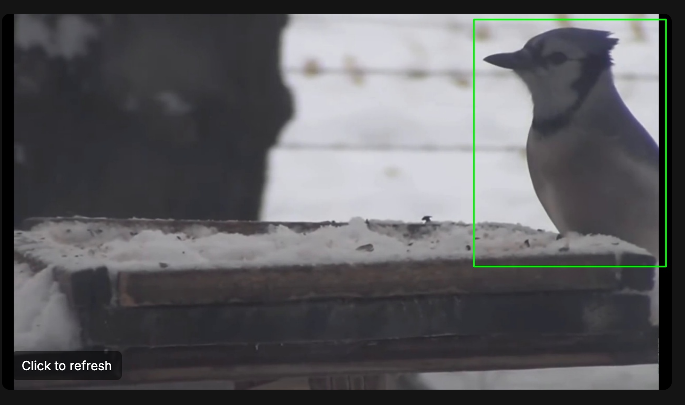
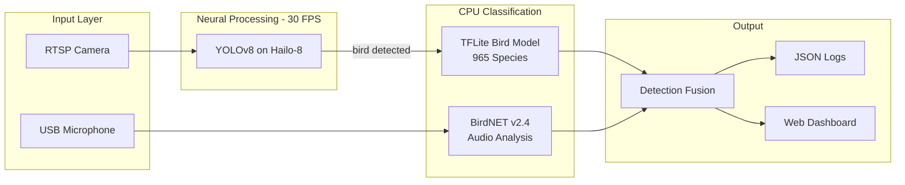
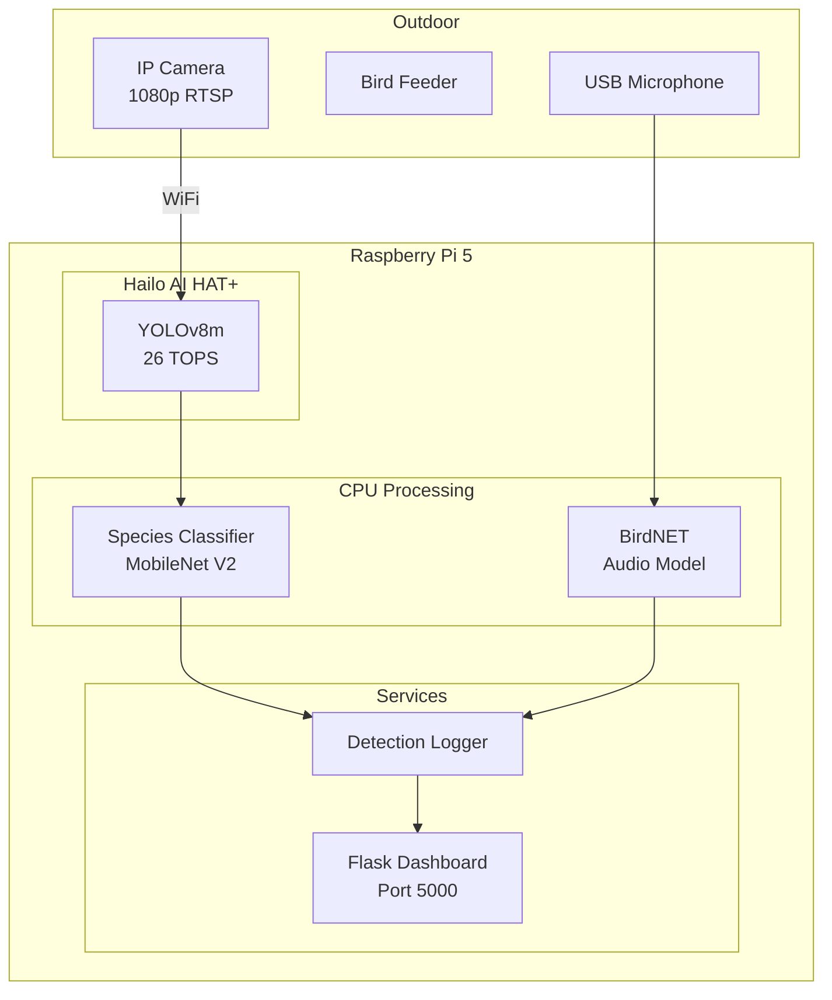
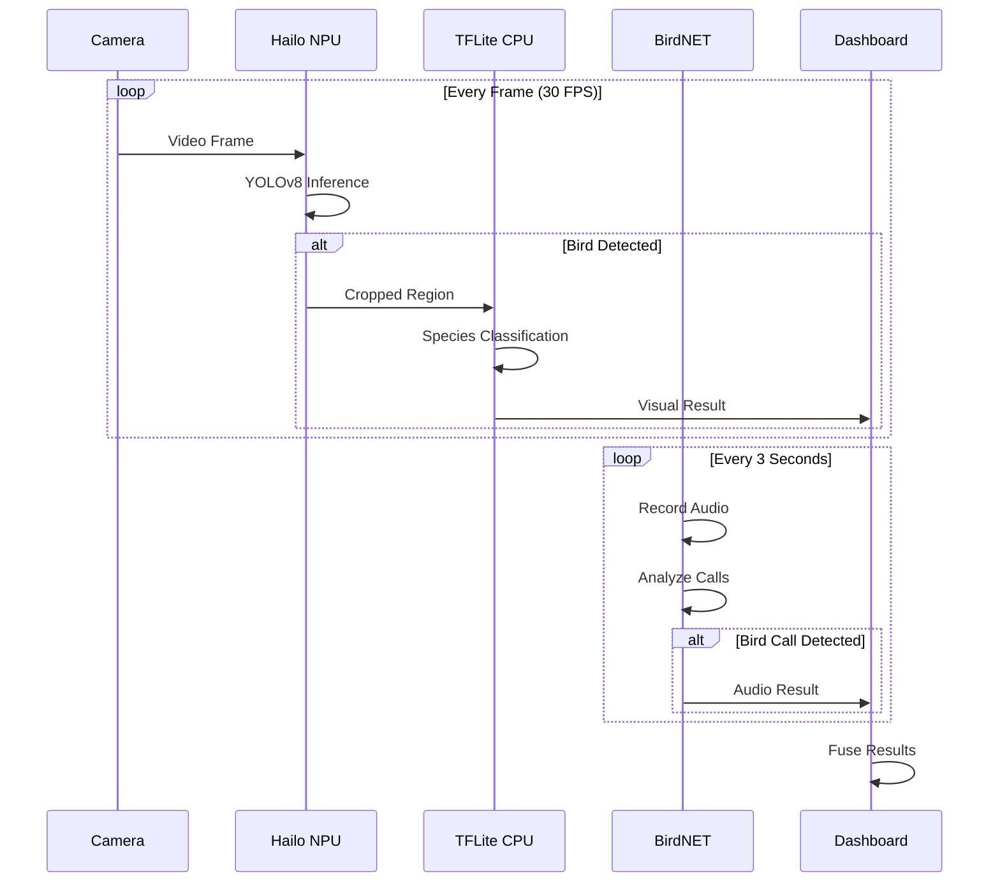
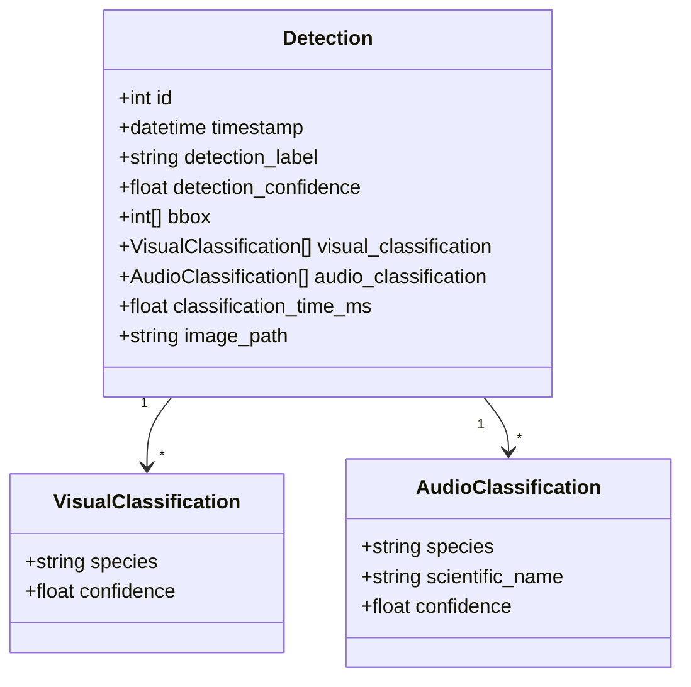
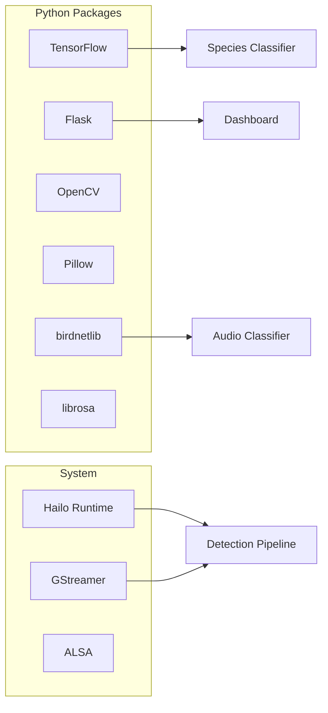

# Bird Watcher

**A hybrid neural detection system for real-time bird identification**

*Hailo-8 NPU detection | TensorFlow Lite classification | BirdNET audio recognition*



---

## The Pipeline



---

## System Architecture



---

## Detection Flow



---

## Hardware

| Component | Specification | Purpose |
|-----------|---------------|---------|
| Raspberry Pi 5 | 4GB+ RAM | Main compute |
| Hailo AI HAT+ | 26 TOPS | Real-time detection |
| IP Camera | 1080p, RTSP, WiFi | Visual input |
| USB Microphone | 48kHz capture | Audio input |
| Power Supply | 27W USB-C | HAT+ requires extra power |

---

## Performance

| Stage | Hardware | Latency | Model |
|-------|----------|---------|-------|
| Object Detection | Hailo-8 NPU | **33ms** | YOLOv8m |
| Species Classification | ARM CPU | **70ms** | MobileNet V2 |
| Audio Analysis | ARM CPU | **1.2s** / 3s clip | BirdNET v2.4 |
| **End-to-end Visual** | | **~100ms** | |

```
Visual Pipeline
├─ YOLO Detection ████ 33ms
└─ Species ID     ██████████████████ 70ms
                  └──────────────────────┘ ~100ms total

Audio Pipeline (parallel)
├─ Recording      ████████████████████████████████████ 3000ms
└─ BirdNET        ████████████ 1200ms
```

---

## Quick Start

```bash
# Clone and setup
git clone https://github.com/louistrue/birdwatch-ai.git
cd bird-watcher
python3 -m venv venv && source venv/bin/activate
pip install tensorflow pillow opencv-python flask birdnetlib librosa

# Download bird model
cd models
curl -L 'https://tfhub.dev/google/lite-model/aiy/vision/classifier/birds_V1/3?lite-format=tflite' -o birds_v1.tflite

# Start detection
cd ~/hailo-rpi5-examples && source setup_env.sh
python3 basic_pipelines/bird_detection.py --input "rtsp://..." --use-frame

# Start dashboard (separate terminal)
cd ~/bird-watcher && source venv/bin/activate
python3 web_dashboard.py
```

Dashboard: `http://<pi-ip>:5000`

---

## Detection Result Structure



Example output:

```json
{
  "id": 42,
  "timestamp": "2026-01-08T14:32:15",
  "detection_label": "bird",
  "detection_confidence": 0.87,
  "visual_classification": [
    {"species": "Cyanocitta cristata (Blue Jay)", "confidence": 0.95}
  ],
  "audio_classification": [
    {"species": "Blue Jay", "scientific_name": "Cyanocitta cristata", "confidence": 0.78}
  ]
}
```

---

## Project Structure

```
bird-watcher/
    species_classifier.py      TFLite inference wrapper
    audio_classifier.py        BirdNET integration
    web_dashboard.py           Flask application
    models/
        birds_v1.tflite        965 species classifier
        bird_labels.txt        Species labels
    detections/                Captured bird images
    logs/                      Daily JSON logs

hailo-rpi5-examples/
    basic_pipelines/
        bird_detection.py      Main detection script
        rtsp_source.py         RTSP camera pipeline
```

---

## Species Coverage

The TFLite model classifies 965 bird species globally. BirdNET provides location-aware filtering based on coordinates.

**Common European Garden Birds:**

| Species | Scientific Name |
|---------|-----------------|
| Great Tit | *Parus major* |
| Blue Tit | *Cyanistes caeruleus* |
| House Sparrow | *Passer domesticus* |
| Blackbird | *Turdus merula* |
| European Robin | *Erithacus rubecula* |
| Chaffinch | *Fringilla coelebs* |
| Greenfinch | *Chloris chloris* |
| Magpie | *Pica pica* |
| Wood Pigeon | *Columba palumbus* |
| Great Spotted Woodpecker | *Dendrocopos major* |

---

## Configuration

**Detection thresholds** in `bird_detection.py`:

```python
confidence_threshold = 0.5      # YOLO detection minimum
classification_cooldown = 2.0   # Seconds between classifications
```

**BirdNET location** in `audio_classifier.py`:

```python
lat = 47.37    # Latitude
lon = 8.54     # Longitude
```

---

## API Endpoints

| Endpoint | Method | Description |
|----------|--------|-------------|
| `/` | GET | Dashboard UI |
| `/api/stats` | GET | Detection statistics |
| `/api/detections` | GET | Today's detections |
| `/api/stream` | GET | Server-Sent Events stream |
| `/images/<name>` | GET | Serve detection images |
| `/latest_frame` | GET | Most recent captured frame |

---

## Troubleshooting

**Hailo not detected:**
```bash
hailortcli fw-control identify
sudo systemctl restart hailort.service
```

**Camera connection failed:**
```bash
ffplay "rtsp://user:pass@ip:554/stream2"
```

**No audio detections:**
```bash
arecord -l                                    # List devices
arecord -D plughw:2,0 -d 5 test.wav          # Test recording
```

---

## Dependencies



---

## License

MIT

---

## Acknowledgments

- Hailo AI for the neural processing unit
- Google AIY for the bird classification model
- Cornell Lab of Ornithology for BirdNET
- Swiss Ornithological Institute for species data
